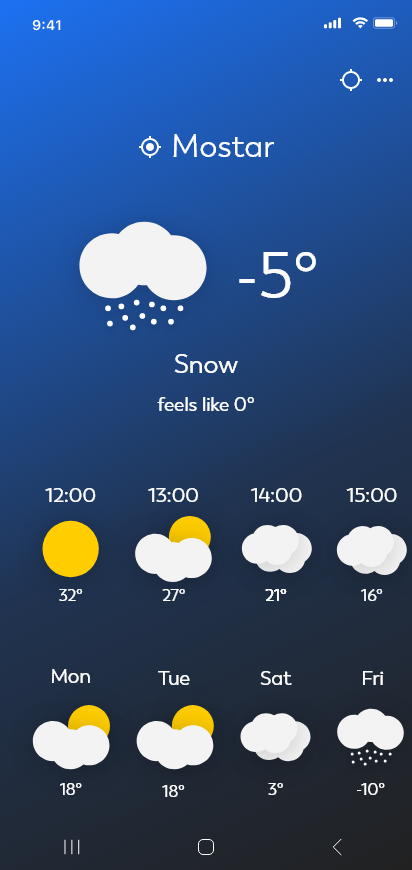

# Vrime
How can you not have a weather app in your portfolio? 
An Android app that gets the latest weather data from OpenWeatherMap and displays it through a simple user interface.
User has the ability to look into weather data for over 200.000 cities across the globe.

## Screens

### Home
Home screen with current and future weather data for the selected location. It has a dynamic background depending on the time of day and type of weather.
  

&ensp;

&ensp;

### Location Picking
User has the ability to chose any of the 200.000 locations that OpenWeatherMap provides.   
By typing in the search query user gets most relevant results from the apps SQLite database.
  

## Library
* [Volley](https://github.com/google/volley)
* [SQLiteAssetHelper](https://github.com/jgilfelt/android-sqlite-asset-helper)
* [Gson](https://github.com/google/gson/)
* [Android Support Library](https://developer.android.com/topic/libraries/support-library/)

## API
[OpenWeatherMap](https://openweathermap.org/)

## Architecture
* Java

## Design
* Adobe Xd

## Developed and Designed By
Abdulmedžid Pehlić
